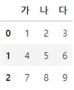

## What is Pandas

- [Pandas](https://pandas.pydata.org/docs/index.html)란 데이터를 효과적으로 처리하고 보여줄 수 있도록 도와주는 라이브러리이다. index에 따라 데이터를 나열하므로 Dictionary 자료형에 가깝다고 보면되다. 

- 판다스는 별칭으로 pd를 사용한다.
> import pandas as pd

### Series
: 시리즈는 인덱스와 값으로 구성된다.

#### 생성
1) **numpy array**로 생성한 경우  
구문은 다음과 같다  
: *pd.Series(<지정할 array>)*
```python
arr = np.arange(10, 15)
# array([10, 11, 12, 13, 14])로 arr 값 할당
s = pd.Series(arr)
s
```
> 0 10  
1 11  
2 12  
3 13  
4 14  
dtype : int32

데이터 타입을 따로 지정할 수 있다.
```python
s = pd.Series(arr, dtype='int64')
```

2) **list**로 생성한 경우  
구문은 다음과 같다.  
: *pd.Series([리스트])*
```python
s = pd.Series(['부장', '차장', '대리', '사원', '인턴'])
s
```
>0 부장  
1 차장  
2 대리  
3 사원  
4 인턴  
dtype: object

Series를 *다양한 타입*(str과 int가 같이 쓰이는 경우 등)의 데이터로 생성시, dtype은 *object*로 생성된다. 

#### index
: python에서와 유사하게 index를 사용할 수 있다.
```python
<pd.Series>.index
# index의 정보 보여줌

<pd.Series>[n]
# index의 n번째 요소를 반환. 단, 음수색인은 불가능하다.
```

Series에 index를 지정할 수 있다.
```python
s = pd.Series(['마케팅', '경영', '개발', '기획', '인사'], index=['a', 'b', 'c', 'd', 'e'])
# a    마케팅
# b     경영
# c     개발
# d     기획
# e     인사
# dtype: object
```
새롭게 부여된 index로 색인이 가능하며, 위치 index로도 접근이 가능하다.

#### values
values는 Series 데이터 값만 numpy array형식으로 가져온다.

#### NaN
Pandas에서 **NaN** 값은 비어있는 **결측치 데이터**를 의미한다. 임의로 비어있는 값을 대입하고자 할 때는 **numpy의 nan (np.nan)**을 입력한다.
- `isnull()` 혹은 `isna()`로 NaN 값을 찾을 수 있다.
> s = pd.Series([1, 2, np.nan, 4, 5])
```pyhton
s.isnull()
# s값 중에서 NaN인 s[2]만 True를 출력한다.
```
#### slicing
Series를 slice할 수 있으나, index로 접근할 시에 끝 index를 포함한다.
```python
s = pd.Series([3, 4, 7, 9], index=['a', 'b', 'c', 'd'])
s[1:3]
# 4와 7을 출력
s['b':'d']
# 4, 7, 9를 출력
```

### DataFrame
: 2차원 데이터 구조. 행(row)과 열(column)로 구성되어 있다. column은 각각의 dtype을 가진다.

#### 생성

- list를 통한 생성
```python
pd.DataFrame([[1, 2, 3],
              [4, 5, 6], 
              [7, 8, 9]], columns=['가', '나', '다'])
# columns 값을 지정하지 않을 경우 숫자 index로 생성된다.
```


#### 속성


#### index 지정

#### column

#### 연습문제

