# Error

## syntax error
: 문법에 오류 있을 경우 나오는 error이다.

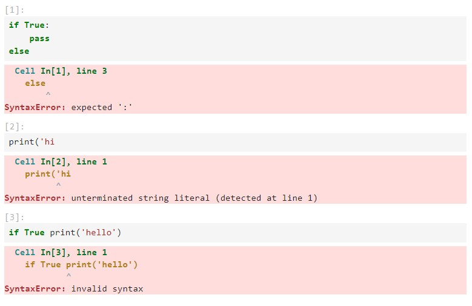

### exception
: 기타 다른 error 중 몇 가지를 소개한다.

- ZeroDivisionError
: 0으로 나눌 수 없을 때 (수학적 오류)

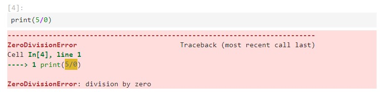

- NameError
: 변수 자체가 없는 등 오류

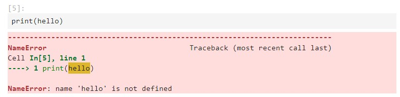

- TypeError
: 타입의 오류

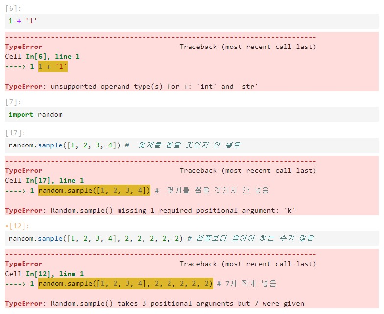

- ValueError
: 값의 오류
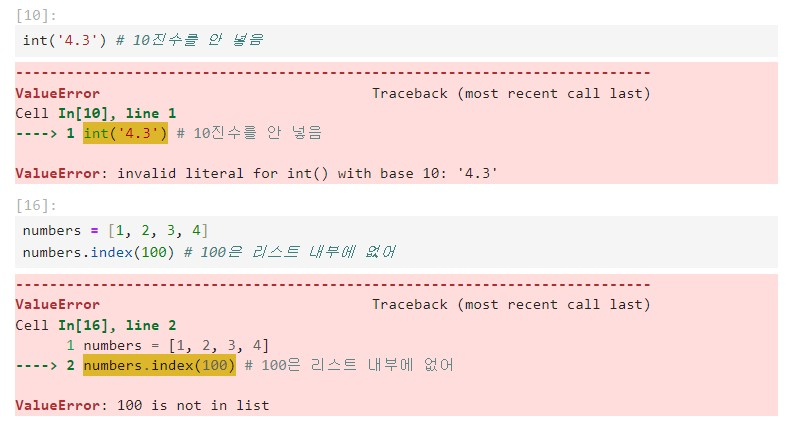

- IndexError
: 문자 오류
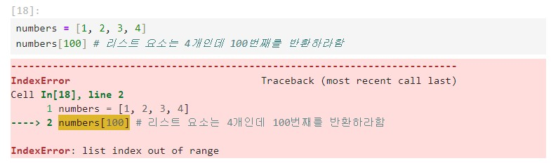

- keyError
: 딕셔너리의 key 오류
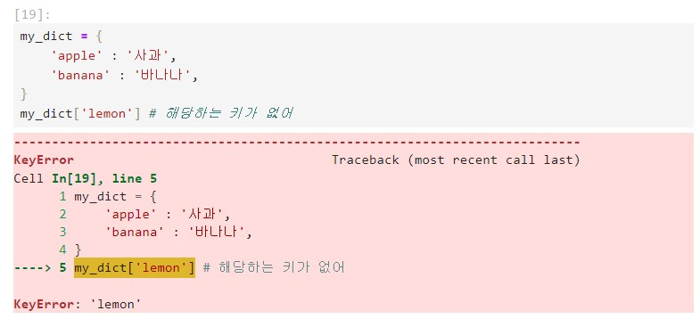

- ModuleNotFoundError
: 모듈 오류
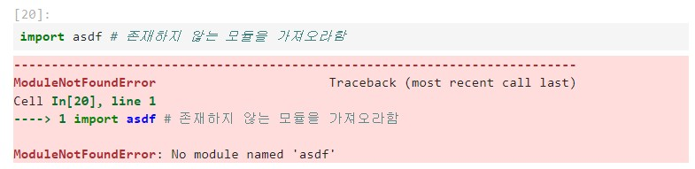


## 예외처리
: 에러가 나는 경우 예외 처리하도록 하는 코드이다.

```python
try:
    code
except 예외 :
    code
```
- 기본 사용 형식
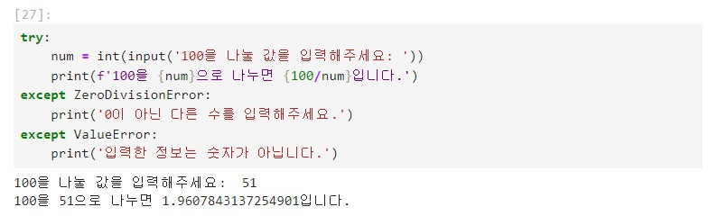

- 한번에 적기
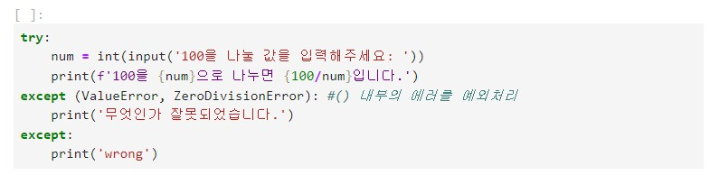

- 모든 에러 처리
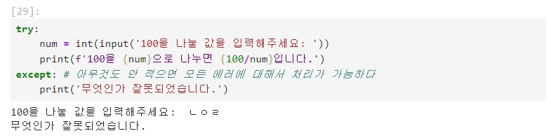

- 에러 내용을 str로 출력하기
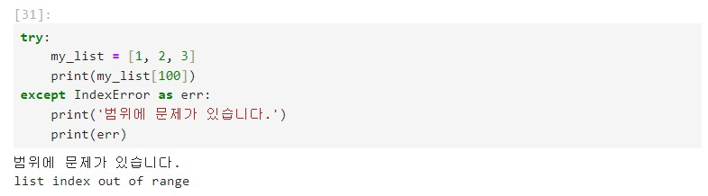

- else
: except error가 발생하지 않을 경우 실행되는 코드
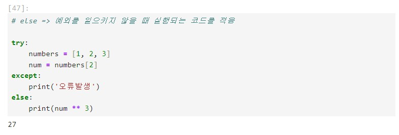

- finally
: 예외 상황과 무관하게 무조건 최종적으로 실행되는 코드
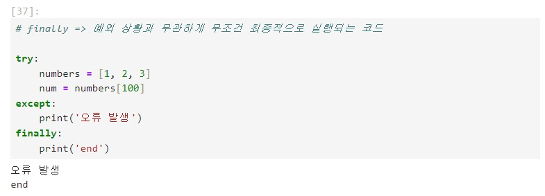

- raise
: 예외를 강제로 발생시킴
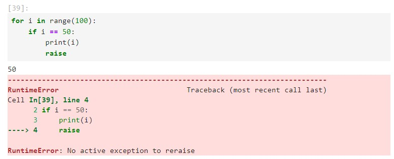

```python
# 예외처리 연습

# 예외처리 연습

def my_div(num1, num2):
    try:
        result = num1 / num2
    except ZeroDivisionError:
        print('0이 아닌 값으로 나눠주세요.')
        # 파이썬이 return None을 자동으로 넣어줘서 None을 결과로 냄
    except TypeError:
        print('str형식이 아닌 float 형식으로 적어주세요.')
        # 파이썬이 return None을 자동으로 넣어줘서 None을 결과로 냄
    else:
        return result


print(my_div(5, 0),)
print(my_div('5', '0'))
print(my_div(5, 2))
```
> 0이 아닌 값으로 나눠주세요. / None / str형식이 아닌 float 형식으로 적어주세요. / None / 2.5 